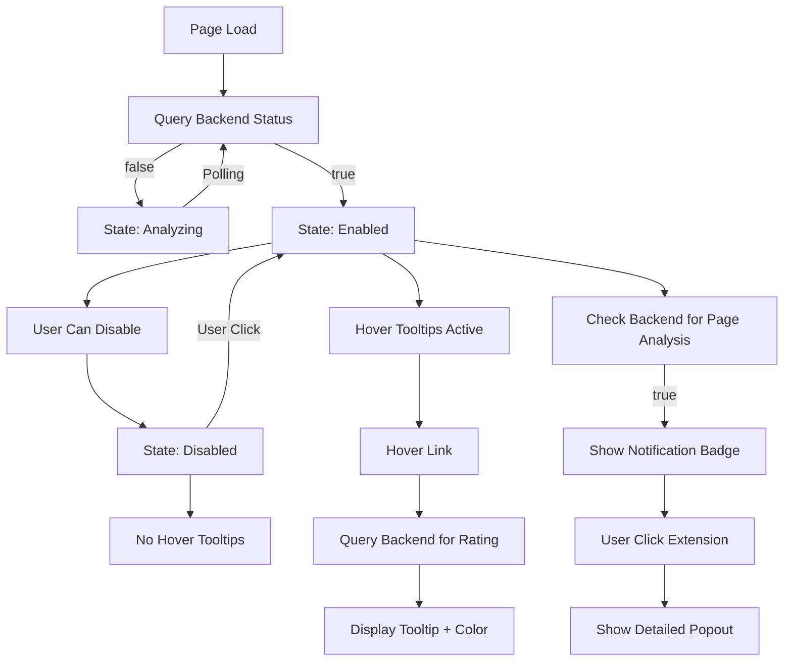

# 🧠 AI Safe Link — Data Flow Specification

## Overview
This document defines the end-to-end data flow and state management for each component in the AI Safe Link Chrome Extension:
- Corner Bubble (Global State Controller)
- Hover Tooltips (Per-Link Analysis UI)
- Browser Popout (Detailed Summary UI)

---

## 🔵 1. AI Safe Link Corner Bubble (Global Controller)

### Purpose
Controls global extension state and determines whether link-level analysis is active.

### States
- `analyzing`
- `enabled`
- `disabled`

### Data Flow

1. **Initial Load**
   - Query backend for sandbox analysis status:
     - `true` → analysis complete
     - `false` → analysis not complete

2. **State Transitions**

   - If backend returns `false`:
     - State = `analyzing`
     - Do NOT allow further queries

   - If backend returns `true`:
     - State → `enabled`

3. **State Behavior**

   #### `analyzing`
   - Display: "Analyzing..."
   - No link queries allowed
   - Poll backend until status becomes `true`

   #### `enabled`
   - Link-level querying is active
   - User can click bubble → transitions to `disabled`

   #### `disabled`
   - Link-level querying is inactive
   - Previously fetched data may be retained (but not displayed)
   - User can click bubble → transitions to `enabled`

---

## 🟡 2. Hover Tooltips (Link-Level Interaction)

### Dependency
- Requires Corner Bubble state

---

### Behavior by Global State

#### If `enabled`
1. On hover over a link:
   - Query backend for:
     - `rating` (1–10)
     - `reasoning` (1–2 sentences)

2. Display tooltip with:
   - Rating
   - Reasoning

3. Apply border color based on rating:
   - `1–3` → 🔴 Red
   - `4–7` → 🟡 Yellow
   - `8–10` → 🟢 Green

---

#### If `analyzing`
- Tooltip displays:
  - "Analysis in progress"
- No backend query is made

---

#### If `disabled`
- No hover effect
- No tooltip displayed
- No backend query is made

---

## 🟢 3. Browser Popout Display (Extension Panel)

### Purpose
Provides detailed, page-level analysis once available

---

### Data Flow

1. **Check Analysis Status (from backend)**

   - If `false` (not complete):
     - Do NOT show notification indicator

   - If `true` (complete):
     - Show notification indicator (bubble on extension icon)

2. **User Interaction**
   - On clicking extension icon:
     - Open popout UI
     - Display:
       - In-depth webpage summary
       - Overall safety assessment
       - All data is sourced directly from the backend

---

## 🔁 High-Level Flow Summary

---

## Notes / Implementation Considerations

- Cache link ratings to avoid repeated backend queries
- Debounce hover events to reduce load
- Polling interval for analysis status should be controlled (e.g., exponential backoff)
- Maintain separation between:
  - Global state (bubble)
  - Link state (tooltips)
  - Page state (popout)
- Full page analysis popout strictly reflects backend-provided data (no local computation)
